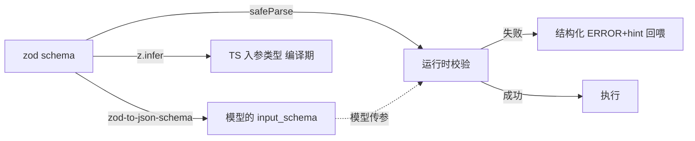
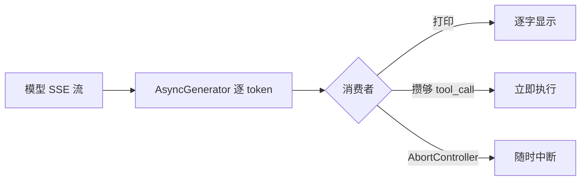

# 维度 01 · 工程基础

> [START-HERE](../START-HERE.md) · [学习总览](./00-overview.md)
> ⬅ 上一：总览 ｜ ➡ 下一：[02 Agent 机制](./02-agent-mechanisms.md) ｜ 🔧 实操：[M1](../practice/m1-agent-loop.md)
> 用时：W1-2 ｜ 主线项目地基

**为什么学**：Coding Agent 本身是个复杂软件系统。模型能力是别人的，你要交付的「执行循环 + 工具系统 + 上下文 + 可观测性」全是硬工程。没有工程力，Agent 只能是「能跑的 demo」。语言顺序：**先 TS（主栈），后 Python（生态对接）**。

---

## 能力清单与目标

| 技能 | 目标 |
|------|------|
| TypeScript（主） | ✅ 读改开源 agent 源码，写出类型严谨工程 |
| Python（辅） | 🟢→✅ 跑模型/评测脚本，读 SWE-bench |
| 测试 / CI | ✅ 项目带单测 + CI + 清晰分层 |
| Shell / 进程 | 🟢 写自动化脚本，理解 Agent 命令执行 |
| Git 工程化 | 🟢→✅ 理解 Agent 如何操作 Git |

---

## 概念精讲（原理 / 对比 / 示意图）

### 工具类型「从 schema 自动推导」为什么是根基
Agent 工具是「模型乱传参」的高风险点。若 schema（给模型的描述）和 TS 类型（给实现的约束）分离，二者会漂移——模型按旧 schema 传参，运行时才崩。**让 zod schema 同时充当「模型描述 + TS 类型 + 运行时校验」三合一**，改一处三处同步，编译期就挡住不匹配。

### ESM vs CJS（Agent SDK 高频踩坑）
| | ESM | CJS |
|---|---|---|
| 语法 | `import/export` | `require/module.exports` |
| 启用 | `package.json:"type":"module"` | 默认 |
| Agent 场景 | 现代 SDK 主推 | 老依赖常是 |
| 典型坑 | import 要带 `.js`；无 `__dirname` | 无顶层 await |

### 流式 vs 一次性输出
流式（SSE→AsyncGenerator）不只是「打字机效果」——它让 Agent **边收边判断**（攒够一个 tool_call 就执行）、随时 `AbortController` 中断，长任务不卡死。

---

## 线性学习路径（逐条打卡）

### A. TypeScript（W1 主攻）

- [ ] **A0 环境骨架**（0.5d）：建 `my-coding-agent`，配 `tsconfig`（ESM、path alias）、`tsx` 运行。✓ `tsx src/index.ts` 能跑
- [ ] **A1 类型复习**（1d）：注解、`interface`/`type`、联合交叉、`unknown`/`never`。✓ 能说清 `unknown` vs `any`
- [ ] **A2 高级类型** ★（1.5d）：泛型、条件类型、`infer`、映射类型。资源：《Effective TypeScript》ch5-6；`vercel/ai-sdk` 的 `tool()` 源码。做：`defineTool` 从 schema **自动推导入参类型**。✓ 传错参数编译期报错
- [ ] **A3 异步与流式** ★（1d）：Promise/async、`AbortController`、`ReadableStream`/`AsyncGenerator`。做：把 LLM SSE 流转成 `AsyncGenerator<string>`。✓ 可逐 token 产出且能取消
- [ ] **A4 工程化**（0.5d）：ESM/CJS 坑、`vitest`、ESLint+Prettier。✓ `npm test` 绿、lint 无错

> A 完即可写工具框架 → 进 [02 Tool Use](./02-agent-mechanisms.md)

### B. Python（W2 上半，生态对接）

- [ ] **B1 语法与包管**（1d）：venv/`uv`、`dataclass`/`pydantic`。✓ 隔离环境跑通模型调用
- [ ] **B2 模型 SDK 与流式**（1d）：Anthropic/OpenAI SDK、streaming、tool calling。✓ 复刻 A3 的流式函数
- [ ] **B3 读评测代码** ★（0.5d）：clone SWE-bench，读 `run_evaluation.py`，画数据流图。✓ 讲清一个 case 从输入到 pass/fail 的步骤

### C. 测试 / CI（W2 下半，融入项目）

- [ ] **C1 单测**（1d）：vitest 断言、**mock LLM**（别烧 token）、覆盖率。✓ 不真实调模型且能验证工具调用
- [ ] **C2 CI**（0.5d）：GitHub Actions 跑 lint+test + 缓存。✓ PR 能看到 CI 状态

### D. Shell（穿插，1d）

- [ ] **D1 Shell 基础**（0.5d）：管道、重定向、退出码 `$?`。✓ 用退出码驱动逻辑
- [ ] **D2 Node 进程** ★（0.5d）：`child_process` 的 exec/spawn/fork、`execa`、超时 kill。做：`runCommand(cmd,{timeout})` 捕获 stdout/stderr/exitCode。✓ 拿到退出码、超时能 kill

### E. Git 工程化（穿插，1d）

- [ ] **E1 Git 底层**（0.5d）：`diff`/`apply`/`stash`/`show`、patch 格式。✓ 读懂 `@@` hunk
- [ ] **E2 程序化 Git** ★（0.5d）：`simple-git`；Agent 如何隔离工作。做：`gitOps` 分支/提交/diff/reset。✓ 分支→改→commit→失败可 reset

---

## 验收自测（全过才进下一维度）

- [ ] `defineTool` 从 schema 自动推导类型
- [ ] 流式输出可用 `AsyncGenerator` 产出并可取消
- [ ] 测试 mock 掉模型，CI 全绿
- [ ] `runCommand` 拿退出码、支持超时 kill
- [ ] `gitOps` 分支/提交/回滚
- [ ] 能讲清 SWE-bench 一个 case 的评测流程
- [ ] 能解释 ESM/CJS 差异、exec vs spawn 区别、为何测试要 mock LLM

---
⬅ [总览](./00-overview.md) ｜ ➡ [02 Agent 机制](./02-agent-mechanisms.md)
