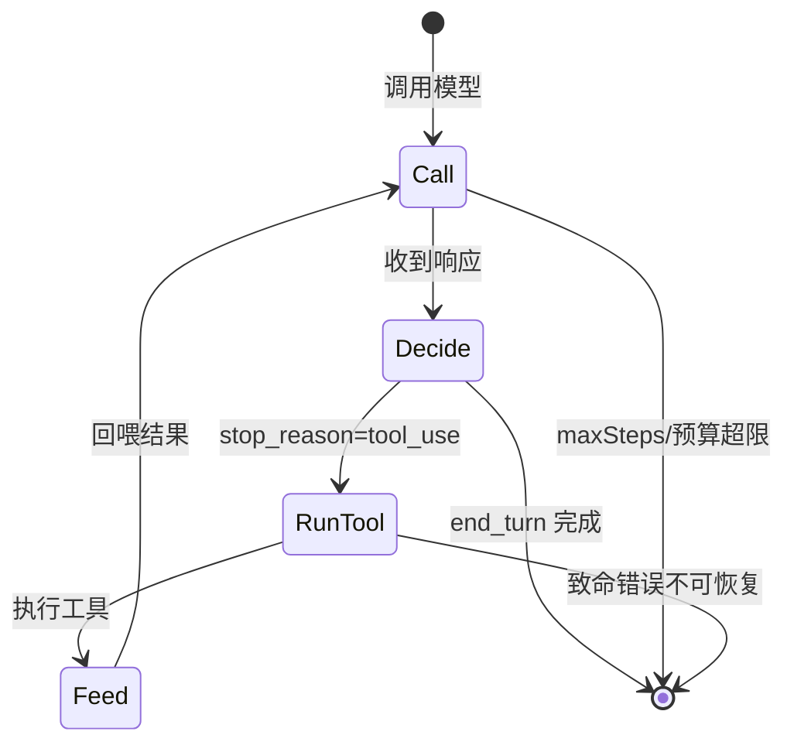
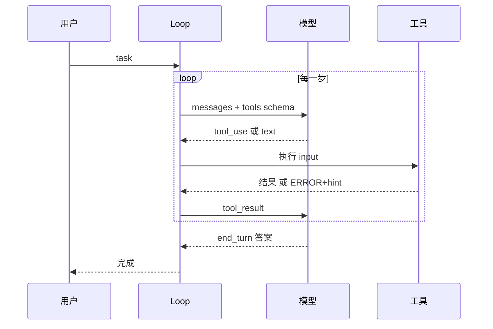
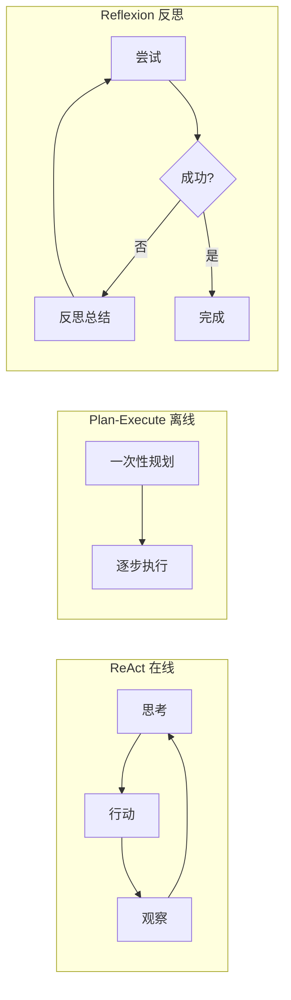
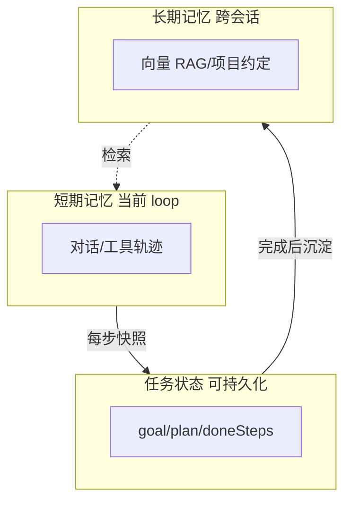

# 维度 02 · Agent 核心机制

> [START-HERE](../START-HERE.md) · [学习总览](./00-overview.md)
> ⬅ 上一：[01 工程基础](./01-engineering.md) ｜ ➡ 下一：[03 系统工程](./03-system-engineering.md) ｜ 🔧 实操：[M1](../practice/m1-agent-loop.md)·[M6](../practice/m6-polish.md)
> 用时：W1-4（与 01 并行）+ W11 进阶

**为什么学**：JD 白纸黑字要的机制全在这——Loop / Tool Use / Context Engineering / Planning / Memory / Prompt / MCP / Subagent。每个词都要能讲清「是什么、为什么、怎么实现、什么情况会坏」。

---

## 能力清单与目标

| 机制 | 目标 |
|------|------|
| Agent Loop | ✅ 手写多种 loop 并讲清取舍 |
| Tool Use | ✅ 注册/调用/校验/错误处理 |
| Context Engineering | ✅ 窗口管理、压缩、选择 |
| Planning | ✅ ReAct/Reflexion/Plan-Execute |
| Memory | ✅ 短期/长期/结构化状态 |
| Prompt Engineering | ✅ 分层 prompt、调优归因 |
| MCP | 🟢→✅ 搭 server 并接入 |
| Subagent / Multi-agent | 🟢 理解分发与协作 |

依赖顺序：**Loop → Tool → Context → Planning → Memory → Prompt → MCP → Subagent**

---

## 概念精讲（原理 / 对比 / 示意图）

### Agent Loop：为什么需要循环
单轮 LLM 只能「想」。真实任务要「想→做→看结果→再想」。Loop 让模型在「调用工具」与「给出答案」间反复切换，直到任务完成或触发停止条件。**停止条件是 loop 的安全阀**——没有它，Agent 会无限循环烧 token。

> 四类停止条件：① `end_turn`（模型自认完成）② `maxSteps`（步数上限）③ 预算/token 超限 ④ 致命错误。

### Tool Use 的时序
模型不直接执行代码，它**输出结构化的 tool_use 指令**，由你的系统执行后把结果喂回。理解这条链路是排查「工具没被调用 / 调错」的基础。

### 三种规划范式对比
| 范式 | 怎么做 | 适合 | 失败模式 |
|------|--------|------|----------|
| ReAct（在线） | 边想边做，每步决定 | 探索性、未知 repo | 长任务迷路、重复 |
| Plan-Execute（离线） | 先列计划再执行 | 步骤明确的任务 | 计划错全盘错、不会 replan |
| Reflexion（反思） | 失败后总结再重试 | 有明确失败信号 | 多耗一轮反思 |

### Context 预算：为什么不能全塞
模型窗口有限，且「Lost in the Middle」——中间位置的信息易被忽略。**按优先级给上下文排座次**，预算不够就丢低优先级，保证关键信息留在窗口内。（详细机制图见 [03](./03-system-engineering.md)）

### Memory 三层

> Coding Agent 更适合「结构化任务状态」而非纯向量记忆——代码任务的状态是**离散可枚举**的（待办/已改文件/测试状态），精确召回比模糊相似更重要。

---

## 线性学习路径（逐条打卡）

### 1. Agent Loop ★最优先
- [ ] **1.1 理解范式**（0.5d）：ReAct = Reason+Act；`感知→思考→行动→观察`；停止条件；为何长任务崩。资源：ReAct 论文。✓ 说出 ≥4 种停止条件
- [ ] **1.2 读最小实现**（0.5d）：`ai-sdk` 的 `generateText({maxSteps})` 或 LangChain AgentExecutor。✓ 一句话说清步进逻辑
- [ ] **1.3 手写 Loop** ★（1d）：`runLoop(task)` 调模型→调工具→喂回→重复，支持 `maxSteps`/`stopReason`。✓ 用 `read_file` 让 Agent 读文件答题（见 [M1](../practice/m1-agent-loop.md)）
- [ ] **1.4 边界控制**（0.5d）：`maxSteps`、token 预算、连续相同 action 检测。✓ 死循环 case 能安全停

### 2. Tool Use
- [ ] **2.1 function calling**（0.5d）：JSON Schema 描述、模型决策、参数回传。资源：Anthropic/OpenAI 文档。✓ 画时序图
- [ ] **2.2 工具注册框架** ★（1d）：`defineTool` + schema 自动转 JSON Schema。✓ 注册 3 工具，loop 正确路由
- [ ] **2.3 校验与错误回喂** ★（0.5d）：zod 校验；失败喂 `{"error","hint"}` 让模型自纠。✓ 传错参模型能据 error 重试
- [ ] **2.4 并行工具**（0.5d，可选）：一次多 tool_call 并发执行

### 3. Context Engineering
- [ ] **3.1 窗口约束**（0.5d）：token 限制、Lost in the Middle。资源：Liu et al.。✓ 解释为何全塞历史会让 Agent 变差
- [ ] **3.2 预算管理器** ★（1d）：`ContextBudget` 按优先级（系统>任务>文件>近期历史>早期历史）填充。✓ 超预算裁剪不崩
- [ ] **3.3 压缩策略**（1d）：摘要/滑窗/选择式保留/结构化状态，各代价。✓ token 降 >50% 仍能完成

> 仓库级（文件选择/RAG）见 [03](./03-system-engineering.md)

### 4. Planning
- [ ] **4.1 三范式**（0.5d）：ReAct/Plan-Execute/Reflexion。资源：三论文。✓ 各适用场景与失败模式
- [ ] **4.2 Plan 模式** ★（1d）：生成 todo 逐步勾选。✓ 5 步任务看到 todo 推进
- [ ] **4.3 Replan**（0.5d）：失败 N 次触发重新规划。✓ 走不通自动换路

### 5. Memory
- [ ] **5.1 分层模型**（0.5d）：短期/长期/任务状态。✓ 各举例
- [ ] **5.2 结构化任务状态** ★（0.5d）：`TaskState{goal,plan,doneSteps,...}` 落盘。✓ 重启可恢复（为续跑铺路）
- [ ] **5.3 向量长期记忆**（1d，可选）：embedding+向量库。✓ 说清为何 Coding Agent 更适合结构化状态

### 6. Prompt Engineering
- [ ] **6.1 分层 system prompt**（0.5d）：角色/规则/工具/格式。✓ 稳定输出 tool_call
- [ ] **6.2 few-shot 与调优**（0.5d）：定位「prompt 的锅还是 loop 的锅」。做：改一句 prompt 看 pass rate。✓ 用 trace 归因

### 7. MCP
- [ ] **7.1 理解协议**（0.5d）：server/client、stdio/HTTP、tools/resources/prompts。资源：MCP 官方文档。✓ 画 server 暴露工具给 client
- [ ] **7.2 搭 MCP server** ★（1d）：「代码搜索」封装成 server（见 [M6](../practice/m6-polish.md)）。✓ 外部 client 调到你的工具
- [ ] **7.3 接入 agent**（0.5d）：内置工具与 MCP 工具共存。✓ 说清何时用 MCP、何时自建

### 8. Subagent / Multi-agent（W11，可选）
- [ ] **8.1 模式**（0.5d）：Subagent 委派 vs Multi-agent 协作；信息损失。✓ 价值与代价
- [ ] **8.2 实现一个 Subagent**（1d）：主 Agent 委派搜索子任务，只回收结论。✓ 主上下文不被搜索细节污染

---

## 验收自测

- [ ] 画出 loop 状态机（含所有停止条件 + 死循环防护）
- [ ] 工具框架：schema→类型推导 + 错误回喂 + 校验
- [ ] 预算管理器超预算裁剪不崩
- [ ] plan 模式 + replan 可演示
- [ ] `TaskState` 落盘可恢复
- [ ] 一个可外部调用的 MCP server
- [ ] 能用 trace 区分 prompt 问题 vs 上下文问题

---
⬅ [01 工程基础](./01-engineering.md) ｜ ➡ [03 系统工程](./03-system-engineering.md)
