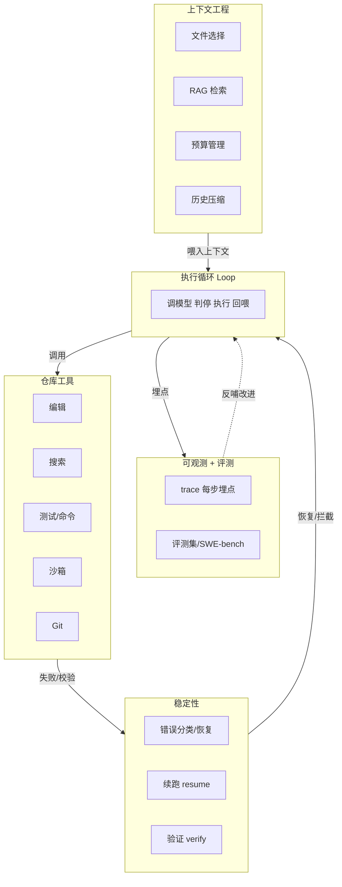
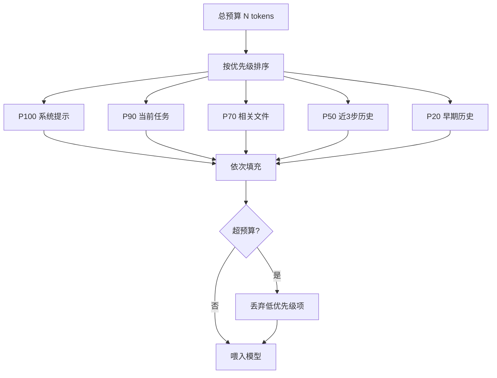
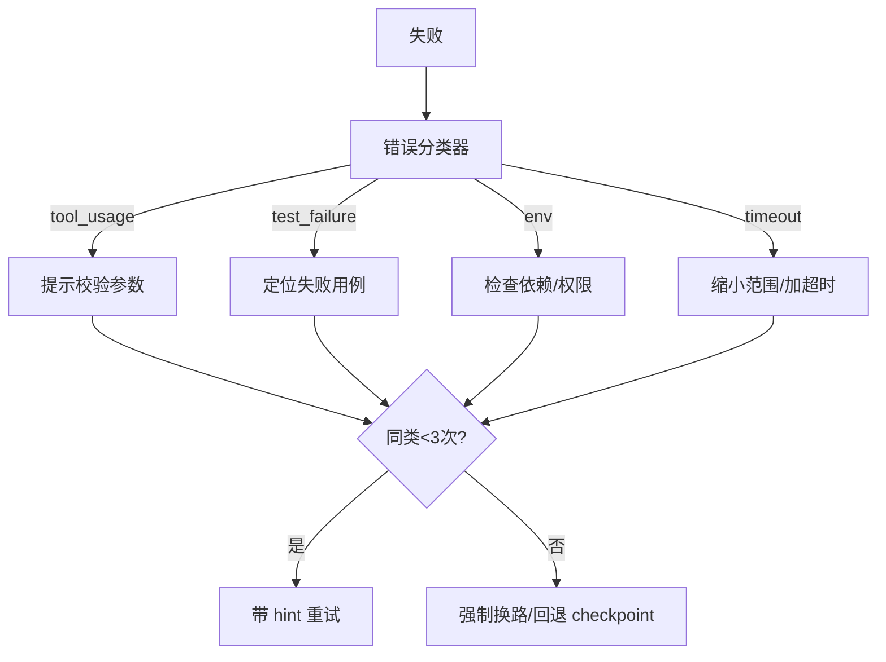

# 维度 03 · Coding Agent 系统工程（岗位核心）

> [START-HERE](../START-HERE.md) · [学习总览](./00-overview.md)
> ⬅ 上一：[02 Agent 机制](./02-agent-mechanisms.md) ｜ ➡ 下一：[04 质量进化](./04-quality.md) ｜ 🔧 实操：[M2](../practice/m2-repo-tools.md)·[M3](../practice/m3-context.md)·[M4](../practice/m4-stability.md)
> 用时：W3-8 ｜ 前置：已会 Loop + 基本工具（02）

**为什么学**：JD「你会做什么」整段都在讲这三件事——**执行循环优化、仓库级工具系统、仓库级上下文工程**。面试深问几乎都在这里。
线性依赖：**先建工具集 → 再建仓库级上下文 → 最后做稳定性**。

---

## 能力清单与目标

| 技能 | 目标 |
|------|------|
| 执行循环：错误恢复 | ✅ 可恢复的失败处理 |
| 执行循环：长任务续跑 | ✅ 状态持久化 + 断点续跑 |
| 执行循环：最终验证 | ✅ 交付前校验闭环 |
| 工具：文件编辑/搜索/测试/沙箱 | ✅ 全套 + 失败处理 |
| 上下文：文件选择/压缩/RAG | ✅ 相关性 + 预算管理 |

---

## 概念精讲（原理 / 对比 / 示意图）

### Coding Agent 整体架构（五层）
把前面所有维度落到一张图：执行循环是心脏，工具/上下文/稳定性/可观测围绕它。**看懂数据流向 = 看懂整个系统**。

### 上下文预算管理器（核心机制）
给一个总 token 预算，按**优先级排序的槽位**填充，超预算从最低优先级开始丢。这比「无脑截断历史」聪明得多。

### 文件编辑：四种策略的取舍
| 策略 | 精确度 | token | 主要失败模式 |
|------|--------|-------|-------------|
| 整文件替换 | 低 | 高 | 易丢内容、大文件爆炸 |
| 行号编辑 | 中 | 低 | 模型数错行号就崩 |
| search-replace | 高 | 低 | 搜索串不唯一需消歧 |
| AST/patch | 最高 | 低 | 实现复杂、格式易错 |

> 业界主流（Aider / Claude Code）选 **search-replace + 唯一性校验 + 改后重读验证**——精确且可自纠。

### 错误恢复决策树
工具失败不是崩，而是**分类后走不同恢复路径**：

---

## 线性学习路径（逐条打卡）

### 阶段 Ⅰ · 仓库工具集（W3-4）→ 实操 [M2](../practice/m2-repo-tools.md)

- [ ] **Ⅰ.1 文件编辑** ★（1.5d）：整文件/行号/search-replace/patch 失败模式；Aider 的 search-replace block。做：`editFile(search,replace)` ①不唯一报错消歧 ②改后重读验证 ③失败回喂。✓ 歧义时 Agent 自动加上下文重试
- [ ] **Ⅰ.2 代码搜索**（1d）：ripgrep + 语义双模；返回带行号。做：`searchCode(query,{mode})`。✓ 搜到函数所有调用点
- [ ] **Ⅰ.3 测试运行**（1d）：选择性跑、**结构化失败回喂**（别喂原始日志）。做：`runTests(pattern)→{passed,failed[]}`。✓ 模型从结构化失败定位代码
- [ ] **Ⅰ.4 沙箱命令执行** ★（1.5d）：白名单/Docker/微VM(Firecracker) trade-off；命令注入风险。做：Docker 包 `runCommand`（挂载、限网、超时）。✓ `rm -rf /` 不影响宿主
- [ ] **Ⅰ.5 串成闭环**（0.5d）：注册全部工具，跑通「读 bug→定位→改→跑测试」。✓ 真实小 repo 修一个简单 issue 成功

### 阶段 Ⅱ · 仓库级上下文工程（W5-6）→ 实操 [M3](../practice/m3-context.md)

- [ ] **Ⅱ.1 文件选择** ★（1d）：import 关系/改动历史/语义/入口优先。做：`relevantFiles(task)` 评分 top-N。✓ 覆盖真实修改点
- [ ] **Ⅱ.2 代码检索 RAG**（1.5d）：embedding 选型、chunk、混合检索（向量+BM25）、rerank。做：建索引 + `retrieveCode(query)`。✓ top-5 含目标修改点
- [ ] **Ⅱ.3 上下文压缩**（1d）：大文件只读相关符号、历史只留决策点。做：接 02 的预算管理器。✓ 50 步任务 token 曲线稳定
- [ ] **Ⅱ.4 与 loop 联调**（0.5d）：每步重算预算动态带文件。✓ 长任务不因上下文过载崩

### 阶段 Ⅲ · 执行循环稳定性（W7-8，JD 反复点名）→ 实操 [M4](../practice/m4-stability.md)

- [ ] **Ⅲ.1 错误恢复** ★（1.5d）：结构化回喂、重试上限、checkpoint 回退、死循环检测、Reflexion。做：错误分类器（工具用法/测试失败/环境/超时）各走不同路径。✓ 改错文件名 case 自纠
- [ ] **Ⅲ.2 长任务续跑** ★（1.5d）：状态机+持久化；**上下文重建≠暴力重放**（用 TaskState 摘要+当前所需上下文）。做：`--resume <id>`。✓ kill→resume→完成，且说清重建方式
- [ ] **Ⅲ.3 最终验证** ★（1d）：五层（编译/测试/回归/diff 审查/目标对齐）；「测试通过≠完成」反例。做：`verify()` build→test→diff-lint→goal-check。✓ 挡住「测试绿但没解决」的 case
- [ ] **Ⅲ.4 稳定性压测**（1d）：5-10 真实 issue 跑全流程，记录成功率与失败模式。✓ 失败模式作为 04 的输入

---

## 验收自测（面试深问区）

- [ ] 编辑工具处理「搜索串不唯一」歧义
- [ ] Docker 沙箱挡住危险命令
- [ ] 文件选择覆盖真实修改点
- [ ] 50 步任务 token 曲线稳定
- [ ] 错误分类器让 Agent 从典型失败自纠
- [ ] kill→resume 续跑，说清上下文重建方式
- [ ] verify() 挡住「测试通过但没解决」的 case
- [ ] 举出 3 个「测试通过≠完成」反例
- [ ] Agent 死循环怎么检测/打断/换思路
- [ ] 1000 文件的 repo 怎么帮 Agent 选出要改的 5 个

---
⬅ [02 Agent 机制](./02-agent-mechanisms.md) ｜ ➡ [04 质量进化](./04-quality.md)
