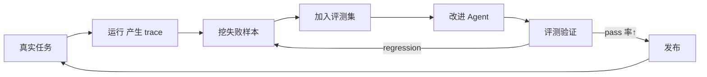
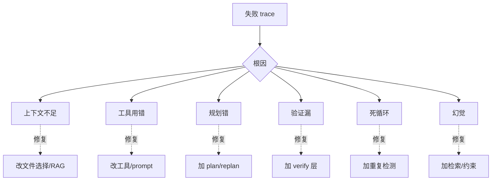

# 维度 04 · 质量与进化（岗位差异化）

> [START-HERE](../START-HERE.md) · [学习总览](./00-overview.md)
> ⬅ 上一：[03 系统工程](./03-system-engineering.md) ｜ ➡ 下一：[05 产品方法](./05-product.md) ｜ 🔧 实操：[M5](../practice/m5-observability-eval.md)
> 用时：W9-12 ｜ 前置：03 的稳定 Agent + 一批失败 case

**为什么学**：JD 原文——「通过 trace、评测和数据持续进化」「定位 Agent 为什么失败，以及如何让它下次成功」。这是把「能跑的 Agent」变成「能持续变强的 Agent」的关键，也是区别于普通「调 API 写应用」的核心壁垒。
线性依赖：**先有 trace 收集数据 → 才能建评测集 → 才能跑 benchmark → 才能做根因分析 → 闭环成飞轮**。

---

## 能力清单与目标

| 技能 | 目标 |
|------|------|
| Evaluation（评测集） | ✅ 干净、不污染的评测集 |
| Benchmark（SWE-bench） | ✅ SWE-bench-lite 跑出分数 |
| Observability | ✅ trace + 指标系统 |
| Trace Analysis | ✅ 从 trace 定位根因 |
| 数据飞轮 | ✅ 失败样本→评测→改进闭环 |

---

## 概念精讲（原理 / 对比 / 示意图）

### 数据飞轮：让 Agent 越用越强
单次改进容易「改好 A 坏 B」。飞轮把每次失败变成**永久的评测 case**，每次改进都用评测验证，形成闭环——Agent 只会单调变强，不会退化。

### 防污染：为什么「在已知 case 上 90%」不可信
若评测集进过训练/上下文，模型可能「背答案」而非真会。防污染 = 评测集与开发集**物理隔离**、用独立 repo 快照、定期换新 case。可信的评测 > 高分的污染评测。

### 失败根因分类（trace 分析的起点）
拿到失败先归类，归类决定修复方向：

---

## 线性学习路径（逐条打卡）

### 阶段 Ⅰ · Trace 系统（W9 前半，一切的地基）→ 实操 [M5](../practice/m5-observability-eval.md)
- [ ] **Ⅰ.1 trace schema**（0.5d）：每步 `{step,thought,tool,args,observation,tokens,latency}` 落 JSON。✓ 还原任意一步现场
- [ ] **Ⅰ.2 结构化采集**（0.5d）：模型/工具调用前后埋点，写 `traces/<id>.jsonl`。✓ 完整无缺字段
- [ ] **Ⅰ.3 回放 viewer** ★（1d）：体验 LangSmith/Langfuse/Phoenix；写极简 viewer 点开看现场。✓ 点开第 N 步看完整现场

### 阶段 Ⅱ · 评测集（W9 后半）
- [ ] **Ⅱ.1 任务定义与判定**（0.5d）：`EvalCase{task,repo,judge}`，判定=二值/LLM-judge/规则。资源：SWE-bench 构造、Aider leaderboard。✓ 判定可重复
- [ ] **Ⅱ.2 防污染** ★（0.5d）：评测集不进上下文/训练；独立 repo 快照；定期换新。✓ 说清「在已知 case 上 90%」为何不可信
- [ ] **Ⅱ.3 建 20-50 case** ★（1d）：分桶 bugfix/feature/refactor，跑自己 Agent 拿基线。✓ 各桶 pass rate 看到短板
- [ ] **Ⅱ.4 多维指标**（0.5d）：pass rate + step/token/cost/耗时。✓ 判断「成功率同但 token 翻倍」算不算改进

### 阶段 Ⅲ · SWE-bench（W10）
- [ ] **Ⅲ.1 读懂构造**（0.5d）：实例来自真实 PR；lite/verified 解决噪声/不可判。✓ 讲清 verified 为何更可信
- [ ] **Ⅲ.2 接入 Agent** ★（1.5d）：实现标准接口（issue+repo→patch→Docker 跑测试）。✓ SWE-bench-lite 拿到基线分数
- [ ] **Ⅲ.3 成本采样控制**（0.5d）：抽样/并行/缓存。✓ 合理成本内反复跑

### 阶段 Ⅳ · 失败根因分析（W11，岗位灵魂）
- [ ] **Ⅳ.1 失败归类** ★（1d）：根因分桶（上下文不足/工具用错/规划错/验证漏/死循环/幻觉），20 case 统计分布。✓ 产出分布图
- [ ] **Ⅳ.2 成败对比**（1d）：同类任务成功 vs 失败 trace diff。✓ 指出失败第几步走偏
- [ ] **Ⅳ.3 根因分析报告** ★（1d）：分布 + 3-5 典型 case + 修复建议。✓ 5 分钟内从 trace 说根因+修复

### 阶段 Ⅴ · 数据飞轮（W12，闭环）
- [ ] **Ⅴ.1 失败转 regression**（0.5d）：`eval/regression/` 固化失败 case。✓ 改坏时 CI 挡住
- [ ] **Ⅴ.2 闭环验证**（0.5d）：改进→评测→看 pass rate+regression→决策。✓ 用数据说「变强了」

---

## 验收自测（最能拉开差距）

- [ ] trace 系统能点开任意一步看现场
- [ ] 20-50 case 评测集 + 防污染说明 + 基线分数
- [ ] SWE-bench-lite 有可复现基线
- [ ] 《失败根因分析报告》5 分钟定位一个 trace
- [ ] regression 能挡「改坏回头」
- [ ] 能用数据回答「30%→35% 算不算真提升」

---
⬅ [03 系统工程](./03-system-engineering.md) ｜ ➡ [05 产品方法](./05-product.md)
