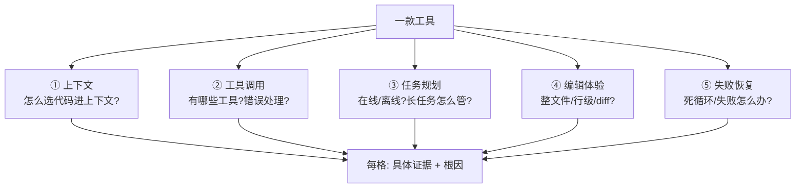

# 维度 05 · 产品方法论

> [START-HERE](../START-HERE.md) · [学习总览](./00-overview.md)
> ⬅ 上一：[04 质量进化](./04-quality.md) ｜ ➡ 下一：[06 软技能](./06-soft-skills.md) ｜ 🔧 贯穿全程，集中产出 W11-12
> 用时：每周 1-2 款工具（全程）+ W11-12 集中

**为什么学**：JD 要「AI 编程工具的高强度用户，能说清不同工具在**上下文/工具调用/任务规划/编辑体验/失败恢复**上的差异」+「产品 sense 和实验品味」。你不是来「实现需求」的，是来「判断该做什么、验证它是否真让 Agent 变强」的。

---

## 能力清单与目标

| 技能 | 目标 |
|------|------|
| 主流工具深度使用 | ✅ 6 款用透，能复现具体行为 |
| 五维对比分析 | ✅ 有论据的对比报告 |
| 产品 sense | 🟢 判断「该不该做」 |
| 实验设计 | 🟢 设计 A/B 验证改进 |

---

## 概念精讲（原理 / 对比 / 示意图）

### 五维分析框架
评价一款 AI 编程工具不是「感觉好用」，而是拆成五个**可追问**的维度，每维都有根因问题。对比报告的质量 = 每个格子有没有具体证据 + 根因。

### 「该不该做」三问（产品 sense）
任何功能上线前回答：① 解决什么**真实**问题？② 真让 Agent 变强（有数据）？③ 能被观测/评测/持续改进？三问全过才值得做——这是把「需求实现者」变成「产品判断者」的分界。

---

## 线性学习路径（逐条打卡）

### 阶段 Ⅰ · 逐个深用六款工具（贯穿 W1-W10，每周一轮）
> 不是装上点两下，而是「完成真实任务 + 故意触发失败 + 读设计」。
对 **Cursor / Copilot / Claude Code / Codex CLI / Windsurf / Aider** 逐一：
- [ ] **每款标准深用**（3-5d/款）：①完成真实多文件任务 ②刻意触发失败观察恢复 ③读官方文档/源码（Aider 必读）④记 ≥3 条有据观察到《功能观察笔记》。✓ 一句话说清每款「最得意设计 + 最大坑」
- [ ] Cursor ｜ [ ] Copilot ｜ [ ] Claude Code ｜ [ ] Codex CLI ｜ [ ] Windsurf ｜ [ ] Aider

### 阶段 Ⅱ · 五维对比报告（W11，核心产出）
- [ ] **Ⅱ.1 同任务横测**（1d）：1 个中等任务用 3 款各跑一遍，录屏记行为。✓ 有可比素材
- [ ] **Ⅱ.2 填五维矩阵** ★（1d）：**上下文/工具调用/任务规划/编辑体验/失败恢复**，每格必须有具体证据，禁「体验好」空话。✓ 每格被追问「为什么」答得出
- [ ] **Ⅱ.3 根因分析**（1d）：追问为何 A 这么做、代价、B 为何不敢。✓ 被问「Cursor 和 Claude Code 失败恢复差在哪、根因」能给有据回答
- [ ] **Ⅱ.4 产出报告**（0.5d）：整合成可发布《六款 AI 编程工具五维对比报告》。✓ 让没用过的人快速建立判断

### 阶段 Ⅲ · 产品 sense + 实验设计（穿插）
- [ ] **Ⅲ.1 灵魂三问**（每周）：挑一个功能回答 JD 核心三问——①解决什么真实问题？②真让 Agent 变强吗？③能被观测/评测/持续改进吗？✓ 累积 ≥10 条笔记
- [ ] **Ⅲ.2 一次完整 A/B**（W12）：改一句 prompt，评测集对比前后，写结论。✓ 回答「30%→35% 该不该采纳，还需看什么」

---

## 验收自测

- [ ] 六款工具各 ≥3 条有据观察
- [ ] 《五维对比报告》每格有证据 + 根因
- [ ] ≥10 条功能观察笔记
- [ ] 一次完整 A/B 实验报告
- [ ] 能说清 Cursor 自动检索 vs Claude Code 主动搜索的优劣与根因
- [ ] 能说清 Aider 为何用 search-replace、代价是什么

---
⬅ [04 质量进化](./04-quality.md) ｜ ➡ [06 软技能](./06-soft-skills.md)
