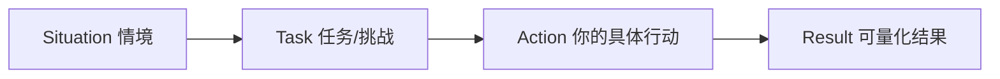
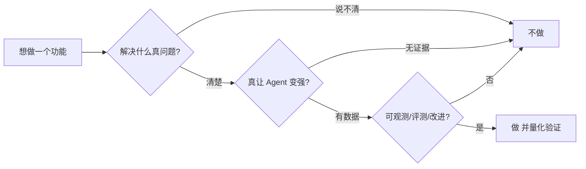

# 维度 06 · 软技能与文化匹配

> [START-HERE](../START-HERE.md) · [学习总览](./00-overview.md)
> ⬅ 上一：[05 产品方法](./05-product.md) ｜ ➡ 下一：收官 ｜ 🔧 实操：[M6](../practice/m6-polish.md)
> 用时：周常习惯（全程）+ W11-12 资产整理

**为什么学**：JD 大量笔墨讲「我们喜欢这样的人」——自驱、敢喷也接受被喷、热爱工具、追问本质。这类岗位必有行为面/文化面，软技能是**通过门槛**，不是锦上添花。

---

## 能力清单与目标

| 技能 | 目标 |
|------|------|
| 自驱力 | ✅ 有「主动发现→拆解→推动」的真实案例 |
| 批判性思维 | ✅ 有理有据地给/接反馈 |
| 英文阅读沟通 | 🟢 跟前沿论文和社区 |
| 追问本质 | ✅ 习惯性问「解决了什么真实问题」 |
| 资产沉淀 | ✅ 可展示的开源/博客/项目 |

---

## 概念精讲（原理 / 对比 / 示意图）

### STAR：把经历讲成有说服力的故事
行为面不是流水账，而是**情境→任务→行动→可量化结果**的结构。重点在 Action 的具体决策与 Result 的数字——面试官追问的全在这两环。

### 追问本质的闭环
JD 要的不是「实现需求」，是每个动作都经「真问题？真有效？可改进？」的审视。养成这个习惯比任何面试技巧都重要——它直接对应「产品 sense」和「自驱」。

---

## 线性学习路径（逐条打卡）

### 习惯 A · 英文前沿跟进（周常，全程）
- [ ] **A.1 定信息源**（W1）：Anthropic/OpenAI/DeepMind 博客、HN、arxiv(cs.CL/SE)、Twitter AI 圈。✓ 每天 15 分钟扫到重要动态
- [ ] **A.2 每周一篇精读**（每周）：写中文摘要（200 字 + 3 takeaways）到 `reading-notes/`。✓ W12 累计 ≥10 篇

### 习惯 B · 主动改进记录（周常，全程）
- [ ] **B.1 每周一个「主动发现」**（每周）：用 STAR 草记一个你主动发现并解决的问题。✓ W12 有 ≥8 个素材

### 习惯 C · 精准吐槽 + 接喷（双周）
- [ ] **C.1 精准批评**（每两周）：对一个开源 agent/博客写 3 条有据批评。✓ 批评被认可「对」而非抬杠
- [ ] **C.2 自我批评文档**（W11）：给 `my-coding-agent` 写《自我批评》——设计哪里有问题、更好做法。✓ 诚实具体可改

### 资产 D · 可展示产出（W11-W12）→ 实操 [M6](../practice/m6-polish.md)
- [ ] **D.1 开源 repo 打磨**（W11）：README 写清定位/架构图/设计决策/trace/评测分。✓ 陌生人 5 分钟看懂深度
- [ ] **D.2 技术博客 ×2**（W11-12）：①一个设计决策的取舍 ②一个「失败→定位→修复」故事（带 trace）。✓ 有具体细节非水文
- [ ] **D.3 开源 PR**（可选）：给一个开源 agent 项目提有质量的 PR。✓ 被合并或有实质讨论

### 故事库 E · STAR 面试准备（W12）
- [ ] **E.1 整理 5-8 个 STAR 故事**（W12）：覆盖——主动推动(自驱)／争议决策(判断)／被批改正(接喷)／工具缺陷发现(敏感)／**trace 定位修复(最对口)**／复杂系统设计(工程力)。✓ 每个有具体结果，经得起追问

---

## 验收自测

- [ ] ≥10 篇英文前沿笔记
- [ ] ≥8 个主动改进素材
- [ ] 《自我批评》文档
- [ ] 开源 repo（5 分钟看懂）+ 2 篇博客
- [ ] 5-8 个 STAR 故事
- [ ] 30 秒真诚讲清「为什么想做 Coding Agent」

---

## 🏁 全部六维度出口检验通过 = 岗位维度就绪

回到 [START-HERE](../START-HERE.md) 或 [学习总览](./00-overview.md) 核对整体合格线 → 具备竞争力，可投递并自信聊设计。
